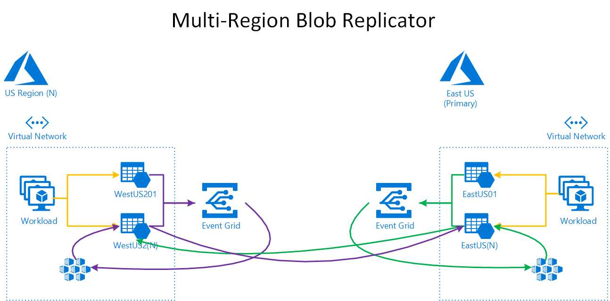

# BlobReplicator

This repo contains a proof of concept to replicate blobs from an Azure Storage Account behind Service Endpoints to another Storage Account behind Service Endpoints. The Storage Accounts could be in the same region or most likely in different regions.



### Assumptions

The problem of replicating blogs has been solved many times over, i.e. [this blog post](https://blogs.msdn.microsoft.com/cloud_solution_architect/2017/11/21/storage-account-replication-with-functions-and-event-grid/); however, there are scenarios in which some of the other solutions may not work. Assumptions for the problem this POC solving for are as follows:

1. N number of source Storage Accounts.
2. N number of destination regions.
3. Target organization operates in regulated industry and/or needs to maintain tight controls over access to the environment.
4. Storage Accounts are protected via Service Endpoints and firewalled off from public Internet access.

### Prerequisites
- [Azure Subscription](https://azure.microsoft.com/)
- [kubectl](https://kubernetes.io/docs/tasks/tools/install-kubectl/) (authenticated to your Kubernetes cluster)
- [Helm v1.10+](https://github.com/helm/helm)
- [Azure CLI 2.0](https://docs.microsoft.com/en-us/cli/azure/install-azure-cli?view=azure-cli-latest)
- [git](https://git-scm.com/downloads)
- [Docker Desktop](https://www.docker.com/products/docker-desktop)

## Getting Started

The following steps are the minimum needed to setup and execute the POC.

### Azure Resource Manager Template

You can follow these steps to help rapidly deploy an environment that mimics the assumptions and provides a platform for the solution.

1. Upload the ARM templates in the `.\templates` folder to a location accessible from the Internet - a Blob Container in an Azure Storage Account will work great. There is no sensitive info in the templates so feel free to make the Container access policy public to avoid needing a SAS.

2. Create a service principal in Azure AD. See the following documentation for details on how to do this. [Tutorial: Deploy an Azure Kubernetes Service (AKS) cluster | Create a service principal](https://docs.microsoft.com/en-us/azure/aks/tutorial-kubernetes-deploy-cluster#create-a-service-principal). Make note of the `appId` and `password` output as you'll need it in the next step.

3. Deploy the ARM template using the following commands making sure to replace the values in ALL CAPS with appropriate values. The namePrefix parameter is just a few characters to distinguish your services and avoid naming conflicts with other tenants and will also serve as FQDN for HTTPTrigger endpoint.

```bash
az group create -n DEMO_RESOURCE_GROUP -l eastus
az group deployment create -g DEMO_RESOURCE_GROUP \
	--template-uri https://LOCATION.OF/THE/TEMPLATE/azuredeploy.json \
	--parameters namePrefix=SOME_UNIQUE_STRING \ 
	servicePrincipalClientId=APPID_FROM_ABOVE \ 
	servicePrincipalClientSecret=PASSWORD_FROM_ABOVE
```
Deploying the template via the commands above will create the following:

- [Azure Container Registry](https://docs.microsoft.com/en-us/azure/container-registry/) (Premium SKU)
- [Azure Container Registry replication](https://docs.microsoft.com/en-us/azure/container-registry/container-registry-tutorial-prepare-registry) across region 1/region 2
- A single-node (Standard DS1 v2 [Azure Kubernetes Service](https://docs.microsoft.com/en-us/azure/aks/intro-kubernetes) cluster in each region
- A [Log Analytics](https://docs.microsoft.com/en-us/azure/azure-monitor/learn/quick-create-workspace) workspace in each region
- The [Container Insights](https://docs.microsoft.com/en-us/azure/azure-monitor/insights/container-insights-overview) pre-configured in each Log Analytics workspace
- A [Virtual Network](https://docs.microsoft.com/en-us/azure/virtual-network/) in each region
	- The virtual network in region 1 will be configured as follows:
		- Address space: 10.0.0.0/23
		- Workload subnet: 10.0.0.0/24
		- AKS subnet: 10.0.1.0/24
	- The virtual network in region 2 will be configured as follows:
		- Address space: 10.0.2.0/23
		- Workload subnet: 10.0.2.0/24
		- AKS subnet: 10.0.3.0/24
- Two [Storage Accounts](https://docs.microsoft.com/en-us/azure/storage/) per region configured with Service Endpoints and firewall enabled. The Storage Accounts will only be accessible by trusted Azure services or from resources attached to the Workload subnet of the Virtual Network that was created in the same region.
- Two static [Public IP](https://docs.microsoft.com/en-us/azure/virtual-network/virtual-network-ip-addresses-overview-arm#public-ip-addresses) addresses which will be used as the IP address for ingress/egress of the Azure Functions running in the AKS clusters in each region. These IP addresses are whitelisted in all Storage Account firewalls to grant requisite access.

### Kubernetes Setup

We'll be using Kubernetes to host the Azure Functions app in a container. The Functions app contains an HTTPTrigger that will respond to the Blob Put events transmitted through EventGrid. We would normally use a Consumption Plan based Functions App but we need to whitelist a static IP on the Storage Account firewalls and therefore AKS offers a great, low cost solution. There are many ways to skin this cat - this is just one option.

**NOTE 1**: Since this is a simple POC, I haven't bothered creating the AKS cluster with RBAC support. 

**NOTE 2**: If you want bi-directional syncing of files, you'll need to execute all `Helm` commands on each AKS cluster. You'll need to merge the AKS context into local kube config for each cluster and then use `kubectl config use-context CONTEXT_NAME` to switch between contexts. You can list all your contexts by running the command: `kubectl config get-contexts`.

#### Kubernetes Let's Encrypt

The following steps add Let's Encrypt capabilities to AKS and must be completed on each cluster. Let's Encrypt will help us generate a valid SSL certificate so we meet the HTTPS requirements of EventGrid webhooks (it's also just good practice).

1. Merge AKS context into local kube config by running the following command using the appropriate values for the resource-group and name options.

```bash
az aks get-credentials --resource-group "DEMO_RESOURCE_GROUP" --name "SOME_UNIQUE_STRING-region-aks"
```

2. Initialize Helm and Tiller on the AKS cluster in current context

```bash
helm init
```

3. Create NGINX Ingress Controller. See the [Let's Encrypt Helm chart README](charts\lets-encrypt\README.md) for more information. You'll need to replace the `XX.XX.XX.XX` with the actual Public IP address created for this AKS cluster during the ARM template deployment.

```bash
helm install stable/nginx-ingress \
    --namespace kube-system \
    --set controller.service.loadBalancerIP="XX.XX.XX.XX" \
    --set controller.replicaCount=1 \
    --set rbac.create=false
```

4. Install cert-manager. Again, see the [Let's Encrypt Helm chart README](charts\lets-encrypt\README.md) for more information.

```bash
kubectl apply -f https://raw.githubusercontent.com/jetstack/cert-manager/release-0.6/deploy/manifests/00-crds.yaml
kubectl create namespace cert-manager
kubectl label namespace cert-manager certmanager.k8s.io/disable-validation=true
helm repo update
helm install --name cert-manager \
    --namespace cert-manager \
    --version v0.6.0 stable/cert-manager \
    --set ingressShim.defaultIssuerName=letsencrypt-prod \
    --set ingressShim.defaultIssuerKind=ClusterIssuer --wait
```

5. Change directories to `.\charts\lets-encrypt` and run the following `Helm` command:

```bash
helm install . --values values.yaml \
  --set clusterIssuer.email=YOUR_EMAIL_ADDRESS \
  --set certificate.name=UNIQUE_CERTIFICATE_NAME \
  --set certificate.dnsName=FQDN_OF_YOUR_PUBLICIP_ADDRESS
```

#### Kubernetes Azure AD Pod Identity Setup

The following steps need to be completed on each AKS cluster and adds [Azure AD Pod Identity](https://github.com/Azure/aad-pod-identity) to the cluster. Azure AD Pod Identity will allow the container in our POD to retrieve the Storage Account keys directly from Azure - avoiding the need to have a complicated key management solution in place for the Storage Accounts.

1. Create the [user-assigned managed identity](https://docs.microsoft.com/en-us/azure/active-directory/managed-identities-azure-resources/overview). Place the managed identity in the same resource group as the target for the ARM template deployment. Make note of the `clientId`, `id`, and `principalId` output values as you'll need them in the following steps.

```bash
az identity create -g DEMO_RESOURCE_GROUP -n MANAGED_IDENTITY_NAME
```

2. Grant the user-assigned managed identity `Contributor` RBAC to the Resource Group containing all our resources (including the Storage Accounts). In a live environment, we'd follow "least privilege" best practices, but for the sake of this POC, this is sufficient.

```bash
az role assignment create --role Contributor --assignee PrincipalIdFromStepAbove --scope /subscriptions/YourSubscriptionId/resourcegroups/DEMO_RESOURCE_GROUP
```

3. "Bind" the AKS Service Principal to the user-assigned managed identity.

```bash
az role assignment create --role "Managed Identity Operator" --assignee AksServicePrincipalId --scope ManagedIdentityIdFromAbove
```

4. Change directories to `.\charts\aad-pod-identity` and run the following `Helm` command.

```bash
helm install . --values values.yaml \
  --set azureIdentity.resourceID=ManagedIdentityIdFromAbove \
  --set azureIdentity.clientID=ManagedIdentityClientIdFromAbove \
  --set azureIdentityBinding.selector=A_VALID_KUBERNETES_LABEL_VALUE
```

#### BlobReplicator Setup

Now that all the prerequisites for BlobReplicator have been deployed to the AKS clusters, we can create the BlobReplicator container, push it to our Azure Container Registry (ACR), and finally deploy it to the AKS clusters.

1. Login to your ACR using the username and password found on the Access Keys section of your ACR.

```bash
docker login -u USERNAME -p PASSWORD ACRNAME.azurecr.io
```

2. Create the Docker container image by changing directories to `.\src\BlobReplicator` and running the following `Docker` command.

```bash
docker build -t blobreplicator:1 .
```

3. Once the container is built, tag it with the fully qualified repository path of your ACR registry.

```bash
docker tag blobreplicator:1 ACRNAME.azurecr.io/blobreplicator:1
```
4. And then push the container image.

```bash
docker push ACRNAME.azurecr.io/blobreplicator:1
```

5. Once all the container image layers are pushed to the ACR, you're ready to deploy the Blob Replicator using the included helm chart. Change directories to `.\src\BlobReplicator\charts\blobreplicator` and run the helm command below to install. You'll need to supply the values from steps above to ensure proper deployment. 

```bash
helm install . --values values.yaml `
  --set image.repository=ACRNAME.azurecr.io/blobreplicator `
  --set image.tag=1 `
  --set ingress.hostname=FQDN_OF_YOUR_PUBLICIP_ADDRESS `
  --set ingress.tls.secretName=UNIQUE_CERTIFICATE_NAME `
  --set labels.aadpodidbinding=A_VALID_KUBERNETES_LABEL_VALUE `
  --set env.subscriptionId=SUBSCRIPTION_ID `
  --set env.resourceGroup=DEMO_RESOURCE_GROUP `
  --set env.region=eastus `
  --set env.destinationRegions=westus2 `
  --set env.hostname=FQDN_OF_YOUR_PUBLICIP_ADDRESS
```

7. After about 3-4 minutes, if you look at the Events section of your Storage Accounts in East US, you'll see event registrations pointing to the FQDN of our Kubernetes Public IP for that region.

### Testing

In order to test, you'll need to create a Container in the Storage Account and upload a file to the Container. Please note that you'll need to do this from a VM running in the Virtual Network or add the IP of your client computer (or other computer) from which you'll be uploading the file. 

Once you've uploaded the file, you should observe that a Container was created in the target Storage Account and the blob file exists. Again, you'll need to add your client IP to the destination Storage Account firewall in order to view the files.

### About The Code

**NOTE**: This code is only POC quality at this point in time. In order to be leveraged in a production level environment, proper exception handling, retry logic, dead-lettering, etc must be implemented.

Having said that, here are some pieces of the code you may be interested in.

#### HealthFunctions.cs

You may have noticed that we never took any steps to create the EventGrid subscriptions for the Blob Put events, yet they were eventually created. That's because I'm leveraging the built-in functionality of Kubernetes' Liveness and Readiness probes. When Kubernetes initially invokes those methods on our Functions App, the code will scan the the specified Resource Group for all Storage Accounts and automatically register the proper EventGrid subscriptions.

#### EventGridFunctions.cs

In order to successfully register our Functions App endpoint as an EventGrid webhook handler, we must validate the initial call sent by EventGrid by replying with a success HTTP status code and the `validationCode` in the body. All other requests handle the actual Blob Put and initiate a server-to-server async copy of the individual blobs.
